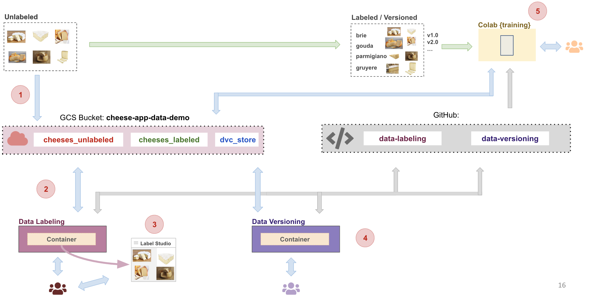

# Tutorial (T6) Cheese App: Data Labeling 

In this tutorial we will build a data pipeline flow as shown:
[PP: CHANGE THIS] 


## Prerequisites
* Have Docker installed
* Cloned this repository to your local machine https://github.com/dlops-io/data-labeling

#### Ensure Docker Memory
- To make sure we can run multiple container go to Docker>Preferences>Resources and in "Memory" make sure you have selected > 4GB

## Cheese App: Data Labeling
In this tutorial we will setup a data labeling web app to label data for the cheese app. We will use Docker to run everything inside containers.

**In order to complete this tutorial you will need your own GCP account setup and your github repo.**


## Setup GCP Credentials
Next step is to enable our container to have access to GCP Storage buckets. 

### Create a local **secrets** folder

It is important to note that we do not want any secure information in Git. So we will manage these files outside of the git folder. At the same level as the `data-labeling` folder create a folder called **secrets**

Your folder structure should look like this:
```
   |-data-labeling
   |-secrets
```

### Setup GCP Service Account
- Here are the step to create a service account:
- To setup a service account you will need to go to [GCP Console](https://console.cloud.google.com/home/dashboard), search for  "Service accounts" from the top search box. or go to: "IAM & Admins" > "Service accounts" from the top-left menu and create a new service account called "data-service-account". For "Service account permissions" select "Cloud Storage" > "Storage Admin" (Type "cloud storage" in filter and scroll down till you find). Then click continue and done.
- This will create a service account
- On the right "Actions" column click the vertical ... and select "Manage keys". A prompt for Create private key for "data-service-account" will appear select "JSON" and click create. This will download a Private key json file to your computer. Copy this json file into the **secrets** folder. Rename the json file to `data-service-account.json`


### Attach GCP Credentials to Container
- To setup GCP Credentials in a container we need to set the environment variable `GOOGLE_APPLICATION_CREDENTIALS` inside the container to the path of the secrets file from the previous step

[PP: I AM THINKING TO DO IT WITH TWO CONTAINERS FIRST]
- We do this by setting the `GOOGLE_APPLICATION_CREDENTIALS` to `/secrets/data-service-account.json` in the docker compose file
- Make sure the `GCP_PROJECT` matches your GCP Project

`docker-compose.yml`
```
version: "3.8"
networks:
    default:
        name: data-labeling-network
        external: true
services:
    data-label-cli:
        image: data-label-cli
        container_name: data-label-cli
        volumes:
            - ../secrets:/secrets
            - ../data-labeling:/app
        environment:
            GOOGLE_APPLICATION_CREDENTIALS: /secrets/data-service-account.json 
            GCP_PROJECT: "ac215-project" [REPLACE WITH YOUR GCP PROJECT]
            GCS_BUCKET_NAME: "cheese-app-data-demo" [REPLACE WITH YOUR BUCKET NAME]
            GCP_ZONE: "us-central1-a"
        depends_on:
            - data-label-studio
    data-label-studio:
        image: heartexlabs/label-studio:latest
        container_name: data-label-studio
        ports:
            - 8080:8080
        volumes:
            - ./docker-volumes/label-studio:/label-studio/data
            - ../secrets:/secrets
        environment:
            LABEL_STUDIO_DISABLE_SIGNUP_WITHOUT_LINK: "true"
            LABEL_STUDIO_USERNAME: "pavlos@seas.harvard.edu" [REPLACE WITH YOUR EMAIL]
            LABEL_STUDIO_PASSWORD: "awesome" [CHANGE IF NECESSARY]
            GOOGLE_APPLICATION_CREDENTIALS: /secrets/data-service-account.json
            GCP_PROJECT: "ac215-project" [REPLACE WITH YOUR GCP PROJECT]
            GCP_ZONE: "us-central1-a"
```

## Prepare Dataset
In this step we will assume we have already collected some data for the cheese app. The images are of various cheeses belonging to either `brie`, `gouda`, `gruyere`, `parmigiano` type. None of the images are labeled and our task here is to use label studio to manage labeling of images.

### Download data
- Download the unlabeled data from [here](https://github.com/dlops-io/datasets/releases/download/v4.0/cheeses_unlabeled.zip)
- Extract the zip file

### Create GCS Bucket
- Go to `https://console.cloud.google.com/storage/browser`
- Create a bucket `cheese-app-data-demo` (REPLACE WITH YOUR BUCKET NAME)
- Create a folder `cheeses_unlabeled` inside the bucket
- Create a folder `cheeses_labeled` inside the bucket

### Upload data to Bucket
- Upload the images from your local folder into the folder `cheeses_unlabeled` inside the bucket

## Run Label Studio Container

### Run `docker-shell.sh` or `docker-shell.bat`
Based on your OS, run the startup script to make building & running the container easy

- Make sure you are inside the `data-labeling` folder and open a terminal at this location
- Run `sh docker-shell.sh` or `docker-shell.bat` for windows

This will run two container. The label studio container and a CLI container that can call API's to label studio. You can verify them by running `docker container ls` on another terminal prompt. You should see something like this:
```
CONTAINER ID   IMAGE                             COMMAND                  CREATED              STATUS              PORTS                                                      NAMES
00d808ab0386   data-label-cli                    "pipenv shell"           About a minute ago   Up About a minute                                                              data-labeling-data-label-cli-run
4ab1ec940b4a   heartexlabs/label-studio:latest   "./deploy/docker-ent…"   2 days ago           Up 2 days           0.0.0.0:8080->8080/tcp                                     data-label-studio
```


## Setup Label Studio

### Create Annotation Project
Here we will setup the Label Studio App to user our cheese images so we can annotate them. 
- Run the Label Studio App by going to `http://localhost:8080/`
- Login with `pavlos@seas.harvard.edu` / `awesome`, use the credentials in the docker compose file that you used
- Click `Create Project` to create a new project
- Give it a project name
- Skip `Data Import` tab and go to `Labeling Setup`
- Select Template: Computer Vision > Image Classification
- Remove the default label choices and add: `brie`, `gouda`, `gruyere`, `parmigiano`
- Save

### Configure Cloud Storage
Next we will configure Label Studio to read images from a GCS bucket and save annotations to a GCS bucket
- Go the project created in the previous step
- Click on `Settings` and select `Cloud Storage` on the left options
- Click `Add Source Storage`
- Then in the popup for storage details:
    - Storage Type: `Google Cloud Storage`
    - Storage Title: `Cheese Images`
    - Bucket Name: `cheese-app-data-demo` (REPLACE WITH YOUR BUCKET NAME)
    - Bucket Prefix: `cheeses_unlabeled`
    - File Filter Regex: `.*`
    - Enable: Treat every bucket object as a source file
    - Enable: Use pre-signed URLs
    - Ignore: Google Application Credentials
    - Ignore: Google Project ID
- You can `Check Connection` to make sure your connection works
- `Save` your changes
- Click `Sync Storage` to start syncing from the bucket to label studio
- Click `Add Target Storage`
- Then in the popup for storage details:
    - Storage Type: `Google Cloud Storage`
    - Storage Title: `Cheese Images`
    - Bucket Name: `cheese-app-data-demo` (REPLACE WITH YOUR BUCKET NAME)
    - Bucket Prefix: `cheeses_labeled`
    - Ignore: Google Application Credentials
    - Ignore: Google Project ID
- You can `Check Connection` to make sure your connection works
- `Save` your changes

### Enable cross-origin resource sharing (CORS)
In order to view images in Label studio directly from GCS Bucket, we need to enable CORS
- Go to the shell where we ran the docker containers
- Run `python cli.py -c`
- To view the CORs settings, run `python cli.py -m`
- To view all the code open `data-labeling` folder in VSCode or any IDE of choice


### Annotate Data
Go into the newly create project and you should see the images automatically pulled in from the GCS Cloud Storage Bucket
- Click on an item in the grid to annotate using the UI
- Repeat for a few of the images

Here are some examples of cheeses and their labels:


### View Annotations in GCS Bucket
- Go to `https://console.cloud.google.com/storage/browser`
- Go into the `cheese-app-data-demo` (REPLACE WITH YOUR BUCKET NAME) and then into the folder `cheeses_labeled`
- You should see some json files corresponding to the images in the `cheeses_unlabeled` that have been annotated
- Open a json file to see what the annotations look like


### View Annotations using CLI
- Get the API key from Label studio for programatic access to data
- Go to User Profile > Account & Settings
- You can copy the Access Token from this screen
- Use this token as the -k argument in the following command line calls
- Go to the shell where ran the docker containers
- Run `python cli.py -p -k` followed by your Access Token. This will list out your projects
- Run `python cli.py -t -k` followed by your Access Token. This will list some tasks from the first project

You will see the some json output of the annotations for each image that is being stored in Label Studio
```
Annotations: [{'id': 5, 'created_username': ' pavlos@seas.harvard.edu, 1', 'created_ago': '1\xa0hour, 53\xa0minutes', 'completed_by': 1, 'result': [{'value': {'choices': ['amanita']}, 'id': 'qHjUzqXO6W', 'from_name': 'choice', 'to_name': 'image', 'type': 'choices', 'origin': 'manual'}], 'was_cancelled': False, 'ground_truth': False, 'created_at': '2023-09-06T17:33:08.558474Z', 'updated_at': '2023-09-06T17:33:08.558492Z', 'draft_created_at': None, 'lead_time': 5.981, 'import_id': None, 'last_action': None, 'task': 1, 'project': 1, 'updated_by': 1, 'parent_prediction': None, 'parent_annotation': None, 'last_created_by': None}]

Annotations: [{'id': 1, 'created_username': ' pavlos@seas.harvard.edu, 1', 'created_ago': '1\xa0hour, 55\xa0minutes', 'completed_by': 1, 'result': [{'value': {'choices': ['amanita']}, 'id': 'Hp3wZORhBI', 'from_name': 'choice', 'to_name': 'image', 'type': 'choices', 'origin': 'manual'}], 'was_cancelled': False, 'ground_truth': False, 'created_at': '2023-09-06T17:31:04.307102Z', 'updated_at': '2023-09-06T17:31:04.307117Z', 'draft_created_at': None, 'lead_time': 11.197, 'import_id': None, 'last_action': None, 'task': 2, 'project': 1, 'updated_by': 1, 'parent_prediction': None, 'parent_annotation': None, 'last_created_by': None}]
```

### 🎉 Congratulations we just setup Label Studio and was able to annotate some data with it


---

---

---


## Docker Cleanup
To make sure we do not have any running containers and clear up an unused images
* Run `docker container ls`
* Stop any container that is running
* Run `docker system prune`
* Run `docker image ls`
