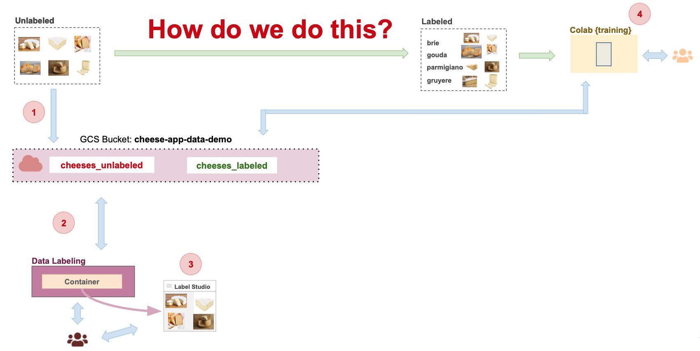

# Tutorial (T6) Cheese App: Data Labeling 

In this tutorial, we will set up Label Studio to support the workflow illustrated below:



Label Studio is an open-source data labeling tool that supports multiple data types, including text, images, and audio. It allows users to create labeled datasets for machine learning models through an interactive web interface.

And of course, we will run Label Studio within a container to keep the setup isolated and manageable.

## Prerequisites

* Have Docker installed
* Cloned this repository to your local machine https://github.com/dlops-io/data-labeling

#### Ensure Docker Memory

- To make sure we can run multiple container go to Docker>Preferences>Resources and in "Memory" make sure you have selected > 4GB

## Cheese App: Data Labeling

In this tutorial, we will set up a data labeling (Label Studio) web app for the cheese app. The entire environment will run inside containers using Docker. Since the app is accessed through a web browser, it’s more convenient to run the container on your laptop.

**In order to complete this tutorial you will need your own GCP account setup.**


## Setup GCP Credentials

Next step is to enable our container to have access to GCP Storage buckets. 

### Create a local **secrets** folder

It is important to note that we do not want any secure information in Git. So we will manage these files outside of the git folder. At the same level as the `data-labeling` folder create a folder called **secrets**

Your folder structure should look like this:

```
   |-data-labeling
   |-secrets
```

### Setup GCP Service Account

- To set up a service account, go to the [GCP Console](https://console.cloud.google.com/home/dashboard), search for “Service accounts” in the top search box, or navigate to “IAM & Admin” > “Service accounts” from the top-left menu. Create a new service account called “data-service-account.” For “Service account permissions,” select “Cloud Storage” > “Storage Admin” (type “cloud storage” in the filter and scroll down until you find it). Then click continue and done.
- This will create a service account.
- In the “Actions” column on the right, click the vertical … and select “Manage keys.” A prompt for “Create private key for ‘data-service-account’” will appear. Select “JSON” and click create. This will download a private key JSON file to your computer. Copy this JSON file into the **secrets** folder and rename it to `data-service-account.json`.

### Attaching GCP Credentials to the Container

- To configure GCP credentials within a container, we need to set the `GOOGLE_APPLICATION_CREDENTIALS` environment variable to point to the path of the secrets file. 
- This is done by setting `GOOGLE_APPLICATION_CREDENTIALS` to `/secrets/data-service-account.json` when running the container. 

- This is handled in the docker-shell scripts.

## Prepare Dataset

In this step we will assume we have already collected some data for the cheese app. The images are of various cheeses belonging to either `brie`, `gouda`, `gruyere`, `parmigiano` type. None of the images are labeled and our task here is to use label studio to manage labeling of images.

### Download data

- Download the unlabeled data from [here](https://github.com/dlops-io/datasets/releases/download/v4.0/cheeses_unlabeled.zip)
- Extract the zip file

### Create GCS Bucket

- Go to `https://console.cloud.google.com/storage/browser`
- Create a bucket `cheese-app-data-demo` (REPLACE WITH YOUR BUCKET NAME)
- Create a folder `cheeses_unlabeled` inside the bucket
- Create a folder `cheeses_labeled` inside the bucket

### Upload data to Bucket

- Upload the images from your local folder into the folder `cheeses_unlabeled` inside the bucket

## Run Label Studio Container

We will be using a pre-built container from DockerHub, heartexlabs/label-studio:latest, so there’s no need to build the image—just run it. We’ll configure the network ports, set `GOOGLE_APPLICATION_CREDENTIALS`, and adjust a few other environment variables. For more details, refer to the docker-shell.sh script.

### Run `docker-shell.sh` or `docker-shell.bat`

Based on your OS, run the startup script to running the container easy

- Make sure you are inside the `data-labeling` folder and open a terminal at this location
- Run `sh docker-shell.sh` or `docker-shell.bat` for windows

This will run our Label Studio container in the background. Note that you won’t see an interactive window, as we’ll be interacting with Label Studio through a browser.

To verify that the container is running, open another terminal and run docker container ls. You should see something similar to this:

```
CONTAINER ID   IMAGE                             COMMAND                  CREATED              STATUS              PORTS                                                      NAMES
data-labeling-data-label-cli-run
4ab1ec940b4a   heartexlabs/label-studio:latest   "./deploy/docker-ent…"   2 days ago           Up 2 days           0.0.0.0:8080->8080/tcp                                     data-label-studio
```


## Setup Label Studio

### Create Annotation Project

Here we will setup the Label Studio App to user our cheese images so we can annotate them. 

- Run the Label Studio App by going to `http://localhost:8080/`
- Login with `pavlos@seas.harvard.edu` / `awesome`, use the credentials in the docker compose file that you used
- Click `Create Project` to create a new project
- Give it a project name
- Skip `Data Import` tab and go to `Labeling Setup`
- Select Template: Computer Vision > Image Classification
- Remove the default label choices and add: `brie`, `gouda`, `gruyere`, `parmigiano`
- Save

### Configure Cloud Storage

Next we will configure Label Studio to read images from a GCS bucket and save annotations to a GCS bucket

- Go the project created in the previous step
- Click on `Settings` and select `Cloud Storage` on the left options
- Click `Add Source Storage`
- Then in the popup for storage details:
  - Storage Type: `Google Cloud Storage`
  - Storage Title: `Cheese Images`
  - Bucket Name: `cheese-app-data-demo` (REPLACE WITH YOUR BUCKET NAME)
  - Bucket Prefix: `cheeses_unlabeled`
  - File Filter Regex: `.*`
  - Enable: Treat every bucket object as a source file
  - Enable: Use pre-signed URLs
  - Ignore: Google Application Credentials
  - Ignore: Google Project ID
- You can `Check Connection` to make sure your connection works
- `Save` your changes
- Click `Sync Storage` to start syncing from the bucket to label studio
- Click `Add Target Storage`
- Then in the popup for storage details:
  - Storage Type: `Google Cloud Storage`
  - Storage Title: `Cheese Images`
  - Bucket Name: `cheese-app-data-demo` (REPLACE WITH YOUR BUCKET NAME)
  - Bucket Prefix: `cheeses_labeled`
  - Ignore: Google Application Credentials
  - Ignore: Google Project ID
- You can `Check Connection` to make sure your connection works
- `Save` your changes

### Enable cross-origin resource sharing (CORS)

At this point, you will notice that you can’t access the images and instead receive an error message related to CORS.

In addition to authentication, GCP buckets restrict access from domains that can’t be resolved via reverse DNS lookup. Since we are running Label Studio on localhost, GCP blocks access due to these default restrictions.

CORS, or **Cross-Origin Resource Sharing**, controls which domains can access resources from a different domain. In this case, we need to allow localhost to access the GCP bucket.

Unfortunately, there’s no direct way to configure CORS for this use case through the GCP web interface—it must be done programmatically.

As a result, we need to set up another container to handle the CORS configuration.

Luckily, our senior engineers have set up things for you. 
The Dockerfile, Pipfiles and docker-CLI.sh is available for you. 

Run `docker-shell-CLI.sh` and that should take you into a 

- Go to the shell where we ran the docker containers

- Run `python cli.py -c`

- To view the CORs settings, run `python cli.py -m`

  


### Annotate Data

Now go back  into the newly create project in Label Studio and you should see the images automatically pulled in from the GCS Cloud Storage Bucket

- Click on an item in the grid to annotate using the UI
- Repeat for a few of the images

Here are some examples of cheeses and their labels:


### View Annotations in GCS Bucket

- Go to `https://console.cloud.google.com/storage/browser`
- Go into the `cheese-app-data-demo` (REPLACE WITH YOUR BUCKET NAME) and then into the folder `cheeses_labeled`
- You should see some json files corresponding to the images in the `cheeses_unlabeled` that have been annotated
- Open a json file to see what the annotations look like

### View Annotations using CLI

The `cli.py` script also offers the functionality to programmatically view the annotations.

- Get the API key from Label studio for programatic access to data
- Go to User Profile > Account & Settings
- You can copy the Access Token from this screen
- Use this token as the -k argument in the following command line calls
- Go to the shell where ran the docker containers
- Run `python cli.py -p -k` followed by your Access Token. This will list out your projects
- Run `python cli.py -t -k` followed by your Access Token. This will list some tasks from the first project

You will see the some json output of the annotations for each image that is being stored in Label Studio

```
Annotations: [{'id': 5, 'created_username': ' pavlos@seas.harvard.edu, 1', 'created_ago': '1\xa0hour, 53\xa0minutes', 'completed_by': 1, 'result': [{'value': {'choices': ['amanita']}, 'id': 'qHjUzqXO6W', 'from_name': 'choice', 'to_name': 'image', 'type': 'choices', 'origin': 'manual'}], 'was_cancelled': False, 'ground_truth': False, 'created_at': '2023-09-06T17:33:08.558474Z', 'updated_at': '2023-09-06T17:33:08.558492Z', 'draft_created_at': None, 'lead_time': 5.981, 'import_id': None, 'last_action': None, 'task': 1, 'project': 1, 'updated_by': 1, 'parent_prediction': None, 'parent_annotation': None, 'last_created_by': None}]

Annotations: [{'id': 1, 'created_username': ' pavlos@seas.harvard.edu, 1', 'created_ago': '1\xa0hour, 55\xa0minutes', 'completed_by': 1, 'result': [{'value': {'choices': ['amanita']}, 'id': 'Hp3wZORhBI', 'from_name': 'choice', 'to_name': 'image', 'type': 'choices', 'origin': 'manual'}], 'was_cancelled': False, 'ground_truth': False, 'created_at': '2023-09-06T17:31:04.307102Z', 'updated_at': '2023-09-06T17:31:04.307117Z', 'draft_created_at': None, 'lead_time': 11.197, 'import_id': None, 'last_action': None, 'task': 2, 'project': 1, 'updated_by': 1, 'parent_prediction': None, 'parent_annotation': None, 'last_created_by': None}]
```

### 🎉 Congratulations we just setup Label Studio and was able to annotate some data with it


## Extra: Using docker-compose to run both containers 

You may have noticed that we run the containers one after another. Often, we need to run multiple containers sequentially or as a bundle. Docker Compose provides this functionality, allowing us to manage multiple containers easily. Refer to the lecture notes for more details.

You can now stop all containers and run them together using `docker-shell-compose.sh`


Note: 

To stop a running Docker container, you can use the following command 
`docker stop <container_name_or_id>`

Replace <container_name_or_id> with the actual container name or ID, which you can find by running: 

`docker ps`

---

---

---


## Docker Cleanup

To make sure we do not have any running containers and clear up an unused images

* Run `docker container ls`
* Stop any container that is running
* Run `docker system prune`
* Run `docker image ls`
